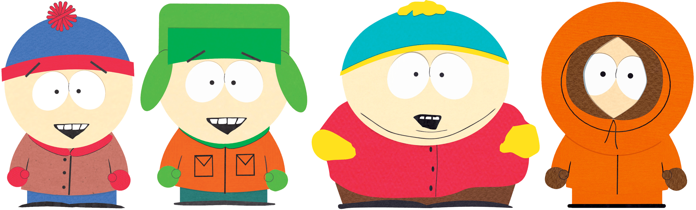

# south-park-diffusion
My South Park character generator

 
 
 

### Implemented generation methods
1) [AE](https://github.com/leffff/south-park-character-generation/blob/main/AE.ipynb)
2) [VAE](https://github.com/leffff/south-park-character-generation/blob/main/VAE.ipynb)
3) [Flow Matching with ODEs](https://github.com/leffff/south-park-character-generation/blob/main/models/flow_matching_ODE.ipynb)
4) [Flow Matching with SDEs](https://github.com/leffff/south-park-character-generation/blob/main/models/flow_matching_SDE.ipynb)

 

### Data
1) [South Park Archive](https://southpark.fandom.com/wiki/South_Park_Archives)
